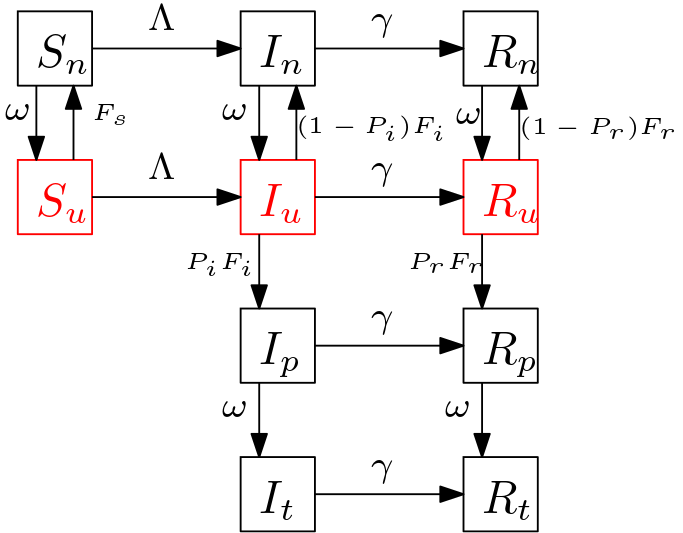

```{r setup, include=FALSE}
knitr::opts_chunk$set(echo = TRUE)
```

Notes on other references: (1) [testing_flow.md](testing_flow.md)(I am using the notation in this doc)

# On Math and Weighting

## Objectives

1- What combination of testing intensity, $\rho$, and isolation, $\eta_w$ and $\eta_t$, will result in $R_0 <1$?


## Model and Definitions

### Assumptions
- Assume there are 3 groups of individuals: $S$, $I$ and $R$.
- Each group splits into 4 subgroups to incorporate the testing mechanism, so overall the model framework has 12 compartments as follows. $S_u,$ $S_n$, $S_p$, $S_t$, $I_u$, $I_n$, $I_p$, $I_t$, $R_u$, $R_n$, $R_p$, $R_t$.
- Further, assume that (1) a perfectly specific test, i.e. no false positives, then $S_p$ and $S_t$ are always zero (2) there are two 'integrator' or 'accumulator' compartments, $N$ and $P$, to collect cumulative reported negative or positive tests. 
- There is a single FoI, $\Lambda$, all groups being exposed to all others. That is, where a susceptible individual move to does not depend on who infected it.

### Parameters

```{r, out.width = "400px"}

```

- $\Lambda$: force of infection defined as $$\Lambda=\beta \frac{(I_u+\eta_w I_n+\eta_w I_p+ \eta_t I_t)}{N_0},$$ where $\beta$ is transmission rate, $\eta_w$ and $\eta_t$ are the isolation parameters for awaiting and reported individuals, respectively. We assume that $\eta_t<\eta_w$, i.e., the awaiting individuals for test results have a higher transmission probability than the reported individuals.
- $\omega$: the rate of *onward flow* from the awaiting positive compartment, $p$, to reported/tested compartment, $\rho$, or from awaiting negative compartment, $n$, back to $u$.  It has units of $1/time$.
- $\gamma$: recovery rate ($1/time$).
- $\rho$: per capita testing intensity ($1/time$).
- $\tau$: the maximum rate of testing the whole untested population ($1/time$).
- $W$: weighted number of people available for tests, defined as $W = W_s S_u + W_i I_u + W_r R_u$.
- $\sigma$: scaling parameter for testing defined as $\sigma = \frac{\tau \rho N_0}{\tau W + \rho N_0}$.
- $F_z$: Weighted testing rate defined as $F_z=\sigma W_z$. That is, $F_s = \sigma W_s$, $F_i=\sigma W_i$ and $F_r = \sigma W_r$.

**Notes:** 
- The complicated part is the flow rate from $Z_u$ to $Z_n$, $Z_p$. The (total, not per capita) flow from $Z_u$ to $Z_n$ is $\rho (1-P_z) F(W_z) Z_u$, from $Z_u$ to $Z_p$ is $\rho P_Z F(W_Z) Z_u$. Where, $P_z$ is the probability of positive test. Thus, $P_i$ represents the test accuracy. We assume $P_s=0$.
- On testing and scaling; at the simplest $F_z=W_z$.  
- JD: If this $\tau$ is fast (e.g., 1d), it should have minimal effects on the system when we're in the usual domain. Since $\tau \gg \rho$, this generally collapses to the original form. When $W$ is super-small, however, it collapses instead to $\tau$.

### Model
The model is
\begin{align}
\label{mod:1}
1)\ d S_u/dt &= -\Lambda S_u - F_s S_u + \omega S_n \\
2)\ d S_n/dt &= -\Lambda S_n + F_s S_u - \omega S_n \\
3)\ d I_u/dt &= \Lambda S_u - F_i I_u + \omega I_n  - \gamma I_u  \\
4)\ d I_n/dt &= \Lambda S_n + (1-P_i) F_i I_u - \omega I_n -\gamma I_n \\
5)\ d I_p/dt &= P_i F_i I_u - \omega I_p -\gamma I_p \\
6)\ d I_t/dt &= \omega I_p - \gamma I_t  \\
7)\ d R_u/dt &= \gamma I_u - F_r R_u + \omega R_n \\
8)\ d R_n/dt &= \gamma I_n + (1-P_r) F_r R_u - \omega R_n  \\
9)\ d R_p/dt &= \gamma I_p + P_r F_r R_u  - \omega R_p  \\
10)\ d R_t/dt&= \gamma I_t + \omega R_p  \\
11)\ dN/dt &= \omega (S_n + I_n + R_n)   \\
12)\ dP/dt &= \omega(I_p + R_p).
\end{align}


```{r packages, message=FALSE}
library(deSolve)
library(ggplot2)
library(tidyr)
library(McMasterPandemic)
library(directlabels)
unpack <- McMasterPandemic::unpack

```

```{r, model formulation}
sir.model <- function(time,state,params){
    unpack(as.list(c(state,params)))
    ## Force of Infection  
    Lambda <- beta * (I_u + eta_w*(I_n+I_p) + eta_t*I_t)/N0
    ## scaling the weights
    sigma <- tau*rho*N0/(tau*(W_s*S_u+W_i*I_u+W_r*R_u)+rho*N0)
    F_s <- sigma*W_s
    F_i <- sigma*W_i
    F_r <- sigma*W_r

    dS_u.dt <- -Lambda*S_u - (1-P_s) * F_s * S_u + omega * S_n
    dS_n.dt <- -Lambda*S_n + (1-P_s) * F_s * S_u - omega * S_n 
    dI_u.dt <-  Lambda*S_u + omega * I_n - F_i * I_u - gamma * I_u
    dI_n.dt <-  Lambda*S_n + (1-P_i) * F_i * I_u  - omega * I_n - gamma * I_n
    dI_p.dt <-  P_i * F_i * I_u - omega * I_p - gamma * I_p 
    dI_t.dt <-  omega * I_p - gamma * I_t 
    dR_u.dt <- gamma * I_u + omega * R_n - F_r * R_u  
    dR_n.dt <- gamma * I_n + (1-P_r) * F_r * R_u - omega * R_n
    dR_p.dt <- gamma * I_p + P_r * F_r * R_u - omega * R_p
    dR_t.dt <- gamma * I_t + omega * R_p
    dN.dt <- omega * (S_n + I_n + R_n)
    dP.dt <- omega *(I_p + R_p)
    
    # return the rate of change
  dxdt <- c(dS_u.dt,dS_n.dt,dI_u.dt,dI_n.dt,dI_p.dt,dI_t.dt,dR_u.dt,dR_n.dt,dR_p.dt,dR_t.dt,dN.dt,dP.dt)
    ## }
    return(list(dxdt))
}

```

```{r model inputs, message=FALSE}
params <- c(N0=1000000, beta=0.8,gamma=1/3, omega=0.25, rho=0.01, 
             W_s=0.01, W_i=1, W_r=0.01, #weights
             P_s=0, P_i=1, P_r=0.5, #prob of waiting for being tested positive
            eta_w=0.02, eta_t=0.01, #isolation parameter 
            s=2, #eta_w/eta_t
            tau=1
            )
class(params) <- "params_pansim"
state_init <- c(S_u=params[["N0"]], S_n=0,
                I_u=1,I_n=0,I_p=0,I_t=0,
                R_u=0,R_n=0,R_p=0,R_t=0,
                N=0,P=0)
d <- seq(0,200,by=0.1)
# Conditional stop for desolver
rootfun <- function (time, state,params) { 
  unpack(as.list(c(state,params)))
  return(I_u - 1) }
```


```{r DFE, message=FALSE}
# DFE; numerical approach
library(rootSolve)
DFE <- function(S,params){
  S_u <- S[1]
  S_n <- S[2]
  I_u <-0
  R_u<-0
  unpack(as.list(params))
  sigma <- tau*rho*N0/(tau*(W_s*S_u+W_i*I_u+W_r*R_u)+rho*N0)
  F_s <- sigma*W_s
 
 return(c(eq1=S_u+S_n-N0,
   eq2=-F_s*S_u+omega*S_n))
}

roots_dfe <- multiroot(DFE, c(1, 1), parms = params, positive = T)
roots_dfe$root


# DFE; analytic approach

Su_dfe <-function(params){
  unpack(as.list(params))
  a <- rho
  b <- -rho+(1-rho/omega)*tau*W_s
  c <- -tau*W_s
  d <- b^2-4*a*c
  
  if(rho){return(N0*2*a/(-b+sqrt(d)))}
    else {return(N0)}
}

Sn_dfe<- params[["N0"]]-Su_dfe(params)


state_dfe <- c(S_u=Su_dfe(params), S_n=Sn_dfe,
                I_u=0,I_n=0,I_p=0,I_t=0,
                R_u=0,R_n=0,R_p=0,R_t=0,
                N=0,P=0)

all.equal(c(state_dfe[["S_u"]],state_dfe[["S_n"]]),roots_dfe$root)
```

Test gradient
```{r}
g1 <- sir.model(time=0,state=state_init, params=params)
all.equal(sum(g1[[1]]),0)
## debug(sir.model)
## g1 <- sir.model(time=0,state=state_init, params=params)
```


```{r model_run, message=FALSE}
out <- as.data.frame(
  ode(
    func=sir.model,
    y=state_init,
    times= d, 
    parms=update(params,beta=2)
    # atol = 1e+1, rtol = 1e+1
    # rootfun = rootfun,
    # method="lsodar"
  )
)

out2 <- out %>%
  pivot_longer(c(S_u,S_n,I_u,I_n,I_p,I_t, R_u,R_n,R_p,R_t), names_to = "compartment", values_to = "value")
```


```{r plot_run1, warning=FALSE}
gg1 <- (ggplot(data=out2, aes(x=time,y=value,col=compartment))
    + geom_line()
    + scale_y_log10(limits=c(0.1,params[["N0"]]))
##    + scale_x_continuous(limits=c(0,240))
)
direct.label(gg1,"last.bumpup")
```

```{r run2, message=FALSE}
d_long <- seq(0,300,by=0.1)
## capturing badly behaved integrator warning messages
cc <- capture.output(
    out_long <- as.data.frame(
        ode(
    func=sir.model,
    y=state_init,
    times= d_long, 
    parms=update(params,beta=2)
    # rootfun = rootfun,
    # method="lsodar"
  )
  ))
out_long2 <- out_long %>%
    pivot_longer(c(S_u,S_n,I_u,I_n,I_p,I_t, R_u,R_n,R_p,R_t),
                 names_to = "compartment", values_to = "value")

```

```{r plot_long, warning=FALSE}
direct.label(gg1 %+% out_long2,"last.bumpup")
```

### Steady States

The Disease-Free Equilibrium, namely $E_1$, for the above SIR model is given by the solution of the following system:
$S_u+S_n=N0$ and $F_s S_u-\omega S_n=0$.
Let $\tilde{S_u}=N_0/S_u$, the positive solution of the quadratic $$a \tilde{S_u}+b \tilde{S_u}^2+c=0,$$
where $a=\rho$, $b= -\rho+(1-\rho/\omega) \tau W_s$ and $c=-\tau W_s$. Let
  $d = b^2-4ac$, the DFE of the model is
  
$$S_u^* =N_0 2 a/(-b+\sqrt d), \\ S_n^*=N_0-S_u^* \\ I_j=R_j=0 \ \forall j$$

### Basic Reproduction Number

The next generation matrix, $G = F V^{-1}$, is in the lower triangular form with $F$ and $G$ as follows.

$$R_0= (A \times S_u^* + B \times S_n^*) \times C,$$ where
$A=\gamma(\omega+\gamma) + (\gamma \eta_w + \omega \eta_t P_i) F_i$,
$B=\big(\omega+(F_i+\gamma)\eta_w\big) \gamma+\frac{(\eta_w \gamma+ \eta_t\omega) \omega P_i F_i }{\omega+\gamma}$ and 
$C=\frac{\beta/\gamma}{N_0 (\gamma(\omega+\gamma)+F_i(\gamma+\omega P_i))}$.

\begin{equation}\label{FV}
F= \beta/N_0 \left[ \begin {array}{cccc} 
S_u&\eta_w\,S_u&\eta_w\,S_u&\eta_t\,S_u\\
S_n&\eta_w\,S_n&\eta_w\,S_n&\eta_t\,S_n\\ 
0&0&0&0\\
0&0&0&0
 \end {array} \right],
 V=
 \left[ \begin {array}{cccc}  
F_i+\gamma&-\omega&0&0\\
-(1-P_i)F_i&\omega+\gamma&0&0\\
-P_i F_i&0&\omega+\gamma&0\\
0&0&-\omega&\gamma
\end {array} \right],
\end{equation}

\begin{equation}
G = \left[ \begin {array}{cc}
G_{11}&G_{12}\\
0&0
\end {array} \right], \text{ where } \\
G_{11} =C
\left[\begin {array}{cc}
A\,S_u & B\,S_u\\
A\,S_n & B\,S_n
\end {array}\right],
\end{equation}

The Eigenvalues of $G_{11}$, are 0 and $R_0$.
```{r R0}

F_i <- function(params){
   # Returns F_i at DFE 
  unpack(as.list(params))
  Su_dfe<- Su_dfe(params)
  Sn_dfe<- N0-Su_dfe
  sigma <- tau*rho*N0/(tau*(W_s*Su_dfe)+rho*N0) #at DFE 
  return(sigma*W_i)
}


 # just a test
  F_i(params=update(params,rho=0))
  
R0<-function(params){
    unpack(as.list(params))
    Su_dfe<- Su_dfe(params)
    Sn_dfe<- N0-Su_dfe
    # print(c(Su_dfe,Sn_dfe,Su_dfe+Sn_dfe))
    F_i <- F_i(params) #at DFE
    
    A <-gamma*(omega+gamma+eta_w*F_i) + omega*eta_t*P_i*F_i
    B <-(omega+eta_w*(F_i+gamma))*gamma+(eta_w*gamma+eta_t*omega)*(omega*P_i*F_i)/(omega+gamma)
      
    C <- beta/(N0*gamma*(gamma*(omega+gamma)+F_i*(gamma+omega*P_i)))
    return((A*Su_dfe+B*Sn_dfe)*C)
}

# R0 expression with eta_w/eta_t factored
R02<-function(params){
    unpack(as.list(params))
    Su_dfe<- Su_dfe(params)
    Sn_dfe<- N0-Su_dfe
    F_i <-F_i(params)  #at DFE
    
    A2 <- gamma*(P_i*F_i*omega*Sn_dfe+(omega+gamma)*(gamma*Sn_dfe+F_i*N0))
    B2 <- P_i*F_i*omega*(gamma*Su_dfe+omega*N0)
    D <- gamma*(omega+gamma)*(gamma*Su_dfe+omega*N0)
    C2 <- beta/((N0*gamma*(gamma*(omega+gamma)+F_i*(gamma+omega*P_i)))*(omega+gamma))
    # s <- eta_w/eta_t
    
    # return((eta_w*A2+eta_t*B2+D)*C2)
    return((eta_t*(s*A2+B2)+D)*C2)
}

# R0<1:
R0(params=params)
# R0>1:
R0(params=update(params,beta=2))

# check
all.equal(R0(params=params),R02(params=params))
```

Can we recover $R_0=\beta/\gamma$ of the simple SIR? -yes
```{r checkings}
# checking if simple R_0 for SIR can be recovered?
# Case #1: rho=0
all.equal(R0(params=update(params,rho=0)), params[["beta"]]/params[["gamma"]])
# Case #2: 
all.equal(R0(params=update(params,eta_t=1,eta_w=1)), params[["beta"]]/params[["gamma"]])
```

### Contour plot of $R_0=1$ and interpretations approache 1
```{r contour_R0_1, message=FALSE,warning=FALSE }
 # specify the ranges
 beta  <- 0.4  ## set beta high enough to allow R0>1 in worst case
 eta_w <- seq(0,1, length.out=5)
 eta_t <- seq(0.001,0.5, length.out=5) #0.001 to 0.5 
 rho     <- seq(0,0.01, length.out=10)
 omega <- seq(0.001,1 , length.out=10) #note omega must be > rho, was 0.1

 df1 <- expand.grid(N0=params[["N0"]],beta=beta,gamma=params[["gamma"]],omega=omega,rho=rho,
                    W_s=params[["W_s"]],W_i=params[["W_i"]],W_r=params[["W_r"]],
                    P_s=params[["P_s"]],P_i=params[["P_i"]],P_r=params[["P_r"]],
                    eta_w=eta_w,eta_t=eta_t,s=params[["s"]],tau=params[["tau"]])
 
# Need to be corrected: in F_i, state_dfe should be changed according to the df1!
df2<- data.frame(df1,R0=apply(df1,1,function(params_in)R0(params=params_in)),
                      Fi= apply(df1,1,function(params_in)F_i(params=params_in)))
                                         
# which(df2[]<0)
```

```{r}
## hacked (not very robustly) to chain label_both() and label_parsed() ...
label_special <- function (labels, multi_line=FALSE, sep = "== ") {
    value <- ggplot2:::label_value(labels, multi_line = multi_line)
    variable <- ggplot2:::label_variable(labels, multi_line = multi_line)
    variable[[1]] <- gsub("_(.)$","[\\1]",variable[[1]])
    ## not using multiple faceting variables on each margin, so forget paste
    out <- Map(paste, variable, value, sep = sep)
    out[[1]] <- lapply(out[[1]], function(expr) c(parse(text=expr)))
    out
}
```

```{r show_contours_1, width=24,height=24,message=FALSE,warning=FALSE}
p1 <- ggplot(df2,aes(x=omega,y=rho,z=R0))+ theme_bw() +
    theme(panel.spacing=grid::unit(0,"lines"))
(p1
    + geom_contour_filled(breaks=pretty(unique(df2$R0),5),
                          alpha=0.5) ## breaks=0.2)
    + geom_contour(breaks=1,alpha=0.5,colour="black")
    + facet_grid(eta_w~eta_t, labeller=label_special)
    + scale_x_continuous(expand=expansion(c(0,0)), n.breaks=3)
    + scale_y_continuous(expand=expansion(c(0,0)), n.breaks=3)
    + scale_fill_viridis_d(name=parse(text="R[0]"))
)
```

### Contour plot of $R_0=1$ and interpretations approache 2, parametrization $s=\eta_w/\eta_t$

```{r contour_R0_2, message=FALSE,warning=FALSE }
 # specify the ranges
 beta  <- 0.4  
 # eta_w <- seq(0,1, length.out=5) 
 eta_t <- seq(0.001,0.5, length.out=5) #0.001 
 rho     <- seq(0,0.01, length.out=5)
 omega <- seq(0.001,1 , length.out=10) #note omega must be > 0, was 0.1
s <- seq(1,2,length.out=5) 
 

 df11 <- expand.grid(N0=params[["N0"]],beta=beta,gamma=params[["gamma"]],omega=omega,rho=rho,
                    W_s=params[["W_s"]],W_i=params[["W_i"]],W_r=params[["W_r"]],
                    P_s=params[["P_s"]],P_i=params[["P_i"]],P_r=params[["P_r"]],
                    eta_w=params[["eta_w"]],eta_t=eta_t,s=s,tau=params[["tau"]])

df22<- data.frame(df11,R0=apply(df11,1,function(params_in)R02(params=params_in)),
                      Fi= apply(df11,1,function(params_in)F_i(params=params_in)),
                       Su=apply(df11,1,function(params_in)Su_dfe(params = params_in)))
min(df22$Su)
which(df22[]<0)          
```

```{r show_contours_2, width=24,height=24,message=FALSE,warning=FALSE}
p11 <- ggplot(df22,aes(x=omega,y=rho,z=R0))+ theme_bw() +
    theme(panel.spacing=grid::unit(0,"lines"))
(p11
    + geom_contour_filled(breaks=pretty(unique(df22$R0),5),
                          alpha=0.5) ## breaks=0.2)
    + geom_contour(breaks=1,alpha=0.5,colour="black")
    + facet_grid(s~eta_t, labeller=label_special)
    + scale_x_continuous(expand=expansion(c(0,0)), n.breaks=3)
    + scale_y_continuous(expand=expansion(c(0,0)), n.breaks=3)
    + scale_fill_viridis_d(name=parse(text="R[0]"))
)
```

Let call the $F_i$ the critical testing rate in the above plot.

**Propositions**

1. $\partial{R_0}/\partial{\eta_t} \geq 0$ and $\partial{R_0}/\partial{\eta_w} \geq 0$.
2. $\partial{R_0}/\partial{\rho} \leq 0$; this is concluded from the Taylor expansion of $R_0$ around $\rho=0$ which is
$R_0 \approx \beta/\gamma + \frac{\beta \rho}{\omega (\omega+\gamma) \gamma^2 W_s} \Big(\gamma(\eta_w-1)(\gamma W_s+\omega W_i) + (\eta_t -1)P_iW_i \omega^2 \Big) + \mathcal{O}(\rho^2)$.
3. Based on the above Taylor expansion around $\rho=0$,
$$\partial{R_0}/\partial{\omega}=  \frac{-\beta \rho}{\gamma W_s\omega^2 (\gamma+\omega)^2}  (a \omega^2 + b \omega + c), $$
where $a=(\eta_w-1)W_i-(\eta_t-1)P_iW_i$, $b=2(\eta_w-1)\gamma W_s$ and $c=(\eta_w-1)\gamma^2 W_s$.
Given that $\eta_t\leq \eta_w$, it is inferred that $a\geq 0$, $b\leq 0$ and $c \leq 0$.
Let $\omega_1<0$ and $\omega_2>0$ be the roots of the quadratic expression in $\partial{R_0}/\partial{\omega}$. Thus, $\partial{R_0}/\partial{\omega}>0$ for $0<\omega<\omega_2$ and  $\partial{R_0}/\partial{\omega}<0$ for $\omega>\omega_2$.

**Interpretation of the R0 contour plot**

Note that $\eta_t\leq \eta_w$, i.e., reported people have a lower transmission probability than awaiting individuals. The perfect isolation/quarantine occurs when $\eta_w=\eta_t=0$ (see the upper left corner panel). Thus, we only consider the lower-triangle panels in the plot [not sure how to extract them in ggplot?].
(1) Looking at the first column of panels, there seems to be a compensatory relation between $\rho$ and $\omega$. i.e., higher $\rho$ requires smaller $\omega$ to keep R0 lower than 1. Also, for a fixed $\omega$, increasing $\eta_w$ requires higher $\rho$ to achieve the critical R0.
(2) A sensible result that we are expecting is $\partial{R_0}/\partial{\omega}<0$.


