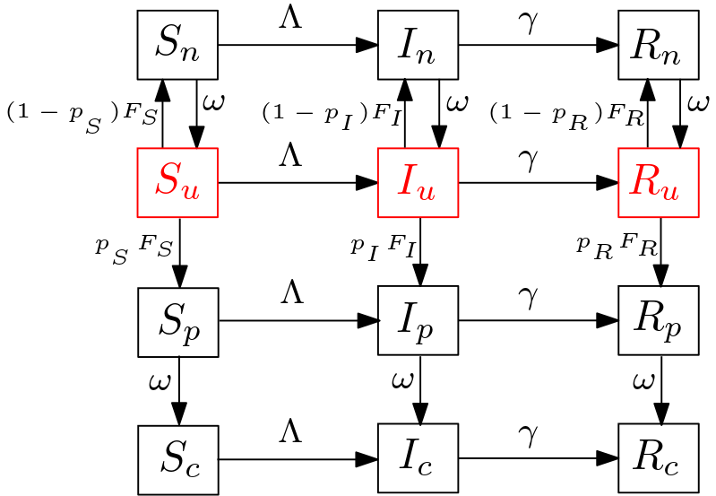

**TO DO** (for contour plots):

- save as PDF
- separate code for these plots into a separate .R file that can be run with a single batch command
- consider using `tikzDevice`

```{r setup, include=FALSE}
knitr::opts_chunk$set(echo = TRUE)
```

Notes on other references: (1) [testing_flow.md](testing_flow.md)(I am using the notation in this doc)

# On Math and Weighting

## Objectives

- An exploration of simple mathematical/computational models of COVID-19 to gain insight into the effects of different levels of testing and isolation on $R_t$/growth rates. The goal is insight.


## Model and Definitions

### Assumptions
JD: Why are we assuming structurally that the test is perfectly specific? I guess it's better to put all of the boxes in and just sometimes assume that that $p_S=0$ 
- Assume there are 3 groups of individuals: $S$, $I$ and $R$.
- Each group splits into 4 subgroups to incorporate the testing mechanism, so overall the model framework has 12 compartments as follows. $S_u,$ $S_n$, $S_p$, $S_t$, $I_u$, $I_n$, $I_p$, $I_t$, $R_u$, $R_n$, $R_p$, $R_t$.
- Further, assume that (1) a perfectly specific test, i.e. no false positives, then $S_p$ and $S_t$ are always zero (2) there are two 'integrator' or 'accumulator' compartments, $N$ and $P$, to collect cumulative reported negative or positive tests. 
- There is a single FoI, $\Lambda$, all groups being exposed to all others. That is, where a susceptible individual move to does not depend on who infected it.

JD: Can we do a better job with capitalization? When $I$ in a subscript refers to the infected class, for example, it should be capitalized. Also, I guess it would be good to always use $P$ for positive (thus $N$ for negative), and then use $p$ for the probabilities. I guess the concern is that $p_S$ looks awkward? But I think clarity is more important.

### Parameters

```{r, out.width = "400px"}

```

- $\Lambda$: force of infection defined as $$\Lambda=\beta \frac{(I_u+\eta_w I_n+\eta_w I_p+ \eta_c I_t)}{N_0},$$ where $\beta$ is transmission rate, $\eta_w$ and $\eta_c$ are the isolation parameters for awaiting and reported individuals, respectively. We assume that $\eta_c<\eta_w$, i.e., the awaiting individuals for test results have a higher transmission probability than the reported individuals.
- $\omega$: the rate of *onward flow* from the awaiting positive compartment, $p$, to reported/tested compartment, $\rho$, or from awaiting negative compartment, $n$, back to $u$.  It has units of $1/time$.
- $\gamma$: recovery rate ($1/time$).
- $\rho$: per capita testing intensity across the whole population ($1/time$).
- $W$: weighted number of people available for tests, defined as $W = W_S S_u + W_I I_u + W_R R_u$.
- $\sigma$: scaling parameter for testing defined as $\sigma = \frac{\rho N_0}{W}$.
- $F_Z$: Weighted testing rate defined as $F_Z=\sigma W_Z$. That is, $F_S = \sigma W_S$, $F_I=\sigma W_I$ and $F_R = \sigma W_R$.

**Notes:** 

- The complicated part is the flow rate from $Z_u$ to $Z_n$, $Z_p$. The (total, not per capita) flow from $Z_u$ to $Z_n$ is $\rho (1-P_Z) F(W_Z) Z_u$, from $Z_u$ to $Z_p$ is $\rho P_Z F(W_Z) Z_u$. Where, $P_Z$ is the probability of positive test. Thus, $p_I$ represents the test accuracy. We assume $p_S=0$.

- On testing and scaling; at the simplest $F_Z=W_Z$.  

### On Testing

- Initial approach and singularity issue (not sure if I call it structural or numerical singularity?); 
$\sigma = \frac{\rho N_0}{W}$ was used initially. The issue was that the population in $S$ compartments appeared to blow up when the DFE is achieved ( in the simulation when time, $t>200$). This is  once the only untested people are susceptibles, the FoI will become $\Lambda=0$, testing rate $F_S=\rho N_0/S_u$. Thus, eq(1) of the model will be $d S_u/dt = - \rho N_0 + \omega S_n$ which is no longer dependent on $S_u$ and a linear rate of leaving the $S_u$ compartment.

### Model

The model is
\begin{align}
\label{mod:1}
1)\ d S_u/dt &= -\Lambda S_u - F_S S_u + \omega S_n \\
2)\ d S_n/dt &= -\Lambda S_n + F_S S_u - \omega S_n \\
3)\ d I_u/dt &= \Lambda S_u - F_I I_u + \omega I_n  - \gamma I_u  \\
4)\ d I_n/dt &= \Lambda S_n + (1-p_I) F_I I_u - \omega I_n -\gamma I_n \\
5)\ d I_p/dt &= p_I F_I I_u - \omega I_p -\gamma I_p \\
6)\ d I_t/dt &= \omega I_p - \gamma I_t  \\
7)\ d R_u/dt &= \gamma I_u - F_R R_u + \omega R_n \\
8)\ d R_n/dt &= \gamma I_n + (1-p_R) F_R R_u - \omega R_n  \\
9)\ d R_p/dt &= \gamma I_p + p_R F_R R_u  - \omega R_p  \\
10)\ d R_t/dt&= \gamma I_t + \omega R_p  \\
11)\ dN/dt &= \omega (S_n + I_n + R_n)   \\
12)\ dP/dt &= \omega(I_p + R_p).
\end{align}

```{r packages, message=FALSE}
source("SIRfunctions.R")
```


```{r model inputs, message=FALSE}
source("params")
```

```{r DFE, message=FALSE}
# DFE; numerical approach
roots_dfe <- multiroot(DFE, c(1, 1), parms = params, positive = T)
roots_dfe$root

# check if the DFE is the same in numerical and analytic:
all.equal(c(state_dfe[["S_u"]],state_dfe[["S_n"]]),roots_dfe$root)
```

Test gradient
```{r}
g1 <- sir.model(time=0,state=state_init, params=params)
all.equal(sum(g1[[1]]),0)
```


```{r model_run, message=FALSE}
sim_time <- seq(0,200,by=0.1)

out <- run.sir(model=sir.model,
               params=update(params,beta=2),
               state=state_init,
               sim_time=sim_time)

out2 <- out %>%
  pivot_longer(c(S_u,S_n,I_u,I_n,I_p,I_t, R_u,R_n,R_p,R_t), names_to = "compartment", values_to = "value")
```


```{r plot_run1, warning=FALSE}
gg1 <- (ggplot(data=out2, aes(x=time,y=value,col=compartment))
            + theme_bw()
            + geom_line()
            + ylab(label="Prevalence")
            + xlab(label="Time (days)")
            + scale_y_log10(limits=c(0.1,params[["N0"]]))
            + xlim(0,310)
)
direct.label(gg1,"last.bumpup")
```

```{r run2, message=FALSE}
sim_time_long <- seq(0,300,by=0.1)
## capturing badly behaved integrator warning messages
cc <- capture.output(
   out_long <- run.sir(model=sir.model,
               params=update(params,beta=2),
               state=state_init,
               sim_time=sim_time_long)
)
    
out_long2 <- out_long %>%
    pivot_longer(c(S_u,S_n,I_u,I_n,I_p,I_t, R_u,R_n,R_p,R_t),
                 names_to = "compartment", values_to = "value")

```

```{r plot_long, warning=FALSE}
p_temp <- direct.label(gg1 %+% out_long2,"last.bumpup")
p_temp
ggsave(p_temp,filename = "sir_sing.pdf" ,
       width = 14, height = 14, units = "cm",
       path="../pix/")
```

### Steady States

The Disease-Free Equilibrium, namely $E_1$, for the above SIR model is given by the solution of the following system:
$S_u+S_n=N0$ and $F_S S_u-\omega S_n=0$. The DFE is

$S_n^*= \frac{\rho}{\omega} N_0, S_u^*= N_0-S_n^*$, and $I_j=R_j=0 \ \forall j$.

### Basic Reproduction Number

The next generation matrix, $G = F V^{-1}$, is in the lower triangular form with $F$ and $G$ as follows.

$$R_0= (A \times S_u^* + B \times S_n^*) \times C,$$ where
$A=\gamma(\omega+\gamma) + (\gamma \eta_w + \omega \eta_c p_I) F_I$,
$B=\big(\omega+(F_I+\gamma)\eta_w\big) \gamma+\frac{(\eta_w \gamma+ \eta_c\omega) \omega p_I F_I }{\omega+\gamma}$ and 
$C=\frac{\beta/\gamma}{N_0 (\gamma(\omega+\gamma)+F_I(\gamma+\omega p_I))}$.

\begin{equation}\label{FV}
F= \beta/N_0 \left[ \begin {array}{cccc} 
S_u&\eta_w\,S_u&\eta_w\,S_u&\eta_c\,S_u\\
S_n&\eta_w\,S_n&\eta_w\,S_n&\eta_c\,S_n\\ 
0&0&0&0\\
0&0&0&0
 \end {array} \right],
 V=
 \left[ \begin {array}{cccc}  
F_I+\gamma&-\omega&0&0\\
-(1-p_I)F_I&\omega+\gamma&0&0\\
-p_I F_I&0&\omega+\gamma&0\\
0&0&-\omega&\gamma
\end {array} \right],
\end{equation}

\begin{equation}
G = \left[ \begin {array}{cc}
G_{11}&G_{12}\\
0&0
\end {array} \right], \text{ where } \\
G_{11} =C
\left[\begin {array}{cc}
A\,S_u & B\,S_u\\
A\,S_n & B\,S_n
\end {array}\right],
\end{equation}

The Eigenvalues of $G_{11}$, are 0 and $R_0$.

```{r R0, echo=FALSE}
F_I(state=state_dfe,params=params)

# R0<1:
R0(params=params)
# R0>1:
R0(params=update(params,beta=2))
# check
all.equal(R0(params=params),R02(params=params))
```

Can we recover $R_0=\beta/\gamma$ of the simple SIR? -yes
```{r checkings}
# checking if simple R_0 for SIR can be recovered?
# Case #1: rho=0
R0_base <-params[["beta"]]/params[["gamma"]]
all.equal(R0(params=update(params,rho=0)), R0_base)
# Case #2: 
all.equal(R0(params=update(params,eta_c=1,eta_w=1)), R0_base)
```

### Contour plot of $R_0=1$ and interpretations approache 1
 <!-- Run sir.plot.R -->


Let call the $F_I$ the critical testing rate in the above plot.

**Propositions**

1. $\partial{R_0}/\partial{\eta_c} \geq 0$ and $\partial{R_0}/\partial{\eta_w} \geq 0$.
That is, the lower isolation the higher $R_0$. Note that perfect isolation occurs at $\eta_w = 0$. 
2. $\partial{R_0}/\partial{\rho} \leq 0$; this is concluded from the Taylor expansion of $R_0$ around $\rho=0$ which is
$R_0 \approx \beta/\gamma + \frac{\beta \rho}{\omega (\omega+\gamma) \gamma^2 W_S} \Big(\gamma(\eta_w-1)(\gamma W_S+\omega W_I) + (\eta_c -1)P_iW_i \omega^2 \Big) + \mathcal{O}(\rho^2)$.
3. Based on the above Taylor expansion around $\rho=0$,
$$\partial{R_0}/\partial{\omega}=  \frac{-\beta \rho}{\gamma W_S\omega^2 (\gamma+\omega)^2}  (a \omega^2 + b \omega + c), $$
where $a=(\eta_w-1)W_I-(\eta_c-1)P_I W_I = ((s-p_I)\eta_c + (p_I-1)) W_I$, $b=2(\eta_w-1)\gamma W_S$ and $c=(\eta_w-1)\gamma^2 W_S$.
Given that $\eta_c\leq \eta_w$, it is inferred that $a\geq 0$, $b\leq 0$ and $c \leq 0$.
Let $\omega_1<0$ and $\omega_2>0$ be the roots of the quadratic expression in $\partial{R_0}/\partial{\omega}$. Thus, $\partial{R_0}/\partial{\omega}>0$ for $0<\omega<\omega_2$ and  $\partial{R_0}/\partial{\omega}<0$ for $\omega>\omega_2$.

In general, $a \geq 0$ is not true. $$a \geq 0 \iff (s-p_I) \eta_c \geq (1-p_I),$$ where $s=\frac{\eta_w}{\eta_c} \geq 1$. As an example, in the case of a very accurate testing regime,  i.e., $P_I=1$, $a \geq 0$ is achieved. 

**Perfect isolation**; When $\eta_w=0$ and consequently $\eta_c=0$. This leads to $a \leq 0$, $b<0$, $c<0$, thus $\partial{R_0}/\partial{\omega} \geq 0$. Intuitively, returning the test results back to the awaiting individuals while they are in a perfect isolation results in an increase of $R_0$.

**Insights from the R0-contour plots**

1. TTI requires lower testing rate than random testing to achieve $R_0=1$.

2. When random testing regime is applied, $W_S=W_I=W_R$,

(i) in the case of perfect isolation of the reported individuals, $\eta_c=0$, the followings are inferred (see the first few columns of the panel plot); 
 - variations of the $\eta_w$ has a negligible effect on the critical testing.
 - for low $\omega$, $R_0$ increases as $\omega$ increases but saturates. This means that when the reporting process is very very slow, increasing the speed of the reporting causes higher $R_0$. Maybe because more people will move to $I_u$ [?, not very sure here.]
 (ii) in case of the non-perfect isolation (see the last column), when $\eta_w$ increases (more awaiting people follow the isolation rules) faster reporting reduces $R_0$.  
Note that it is sensible to expect that $\partial{R_0}/\partial{\omega}<0$. Here we showed that this can be less true. 

3. When TTI regime is applied,


